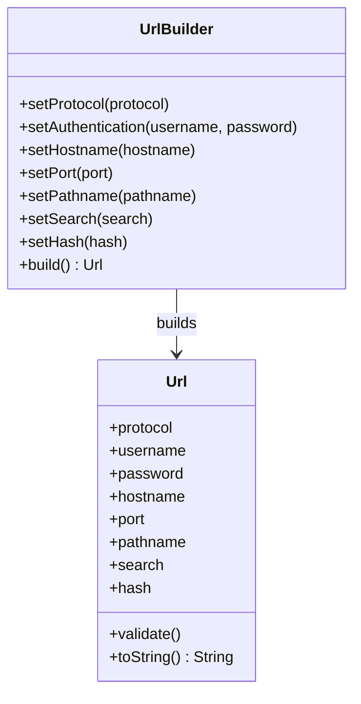

# 05-builder-url-builder

This example demonstrate how to use the builder pattern to simplify the creation of Url object.

## Run

To run the example launch:

```bash
node index.js
```

## Explain
- Builder is a creational design pattern that simplifies the creation of complex objects by providing a `fluent interface`, which allows us to build the object `step by step`. This greatly improves the `readability` and the general developer experience when `creating such complex objects`.
- The most apparent situation in which we could benefit from the `Builder pattern` is a class with a constructor that has a long list of arguments, or takes many complex parameters as input. Usually, these kinds of classes require so many parameters in advance because all of them are necessary to build an instance that is complete and in a consistent state, so it's necessary to take this into account when considering potential solutions.
- Symptom of a class that could benefit from the Builder pattern:
  - The class has a constructor with many parameters.
  ```javascript
  class Url {
    constructor(protocol, host, port, path, query) {
      this.protocol = protocol;
      this.host = host;
      this.port = port;
      this.path = path;
      this.query = query;
    }
  }
  const url = new Url('http', 'example.com', 80, '/path', 'query=string');
  ```
- We can instead summarize some general rules for implementing the Builder pattern, as follows:
  - The main objective is to break down a complex constructor into multiple, more readable, and more manageable steps.
  - Try to create builder methods that can set multiple related parameters at once.
  - Deduce and implicitly set parameters based on the values received as input by a setter method, and in general, try to encapsulate as much parameter setting related logic into the setter methods so that the consumer of the builder interface is free from doing so.

## Class Diagram


